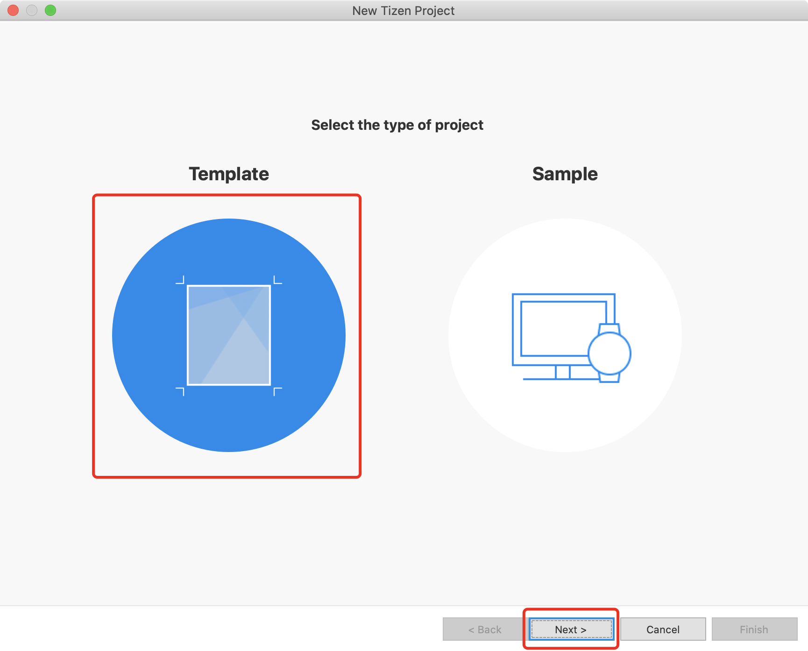
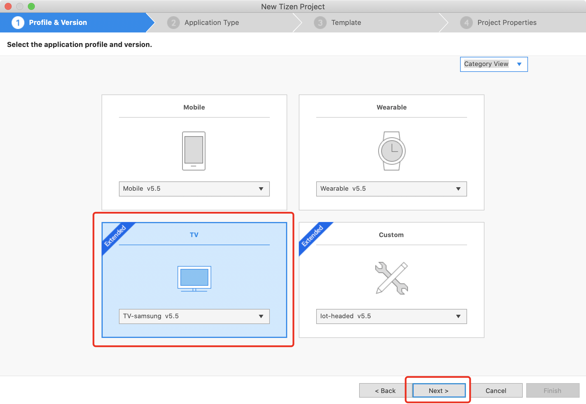
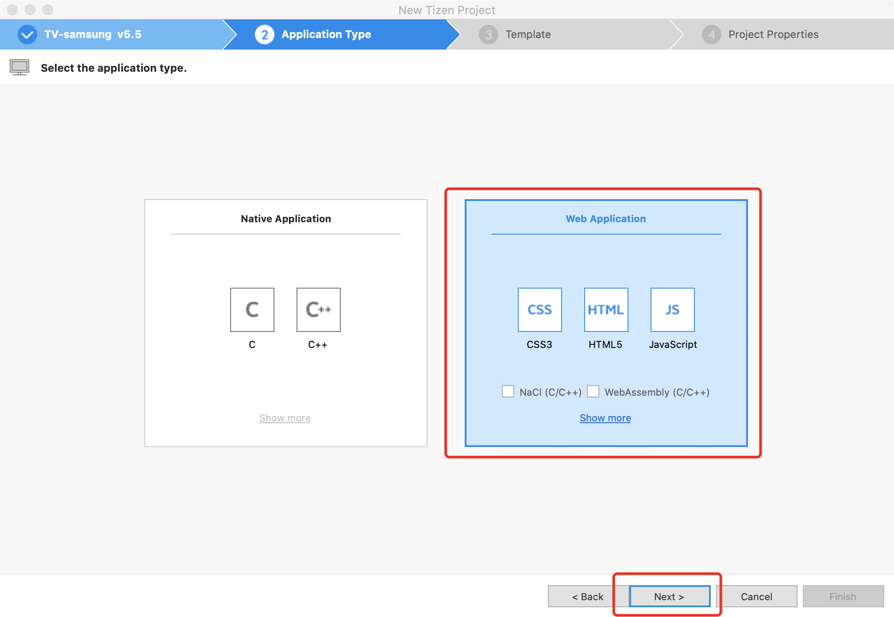
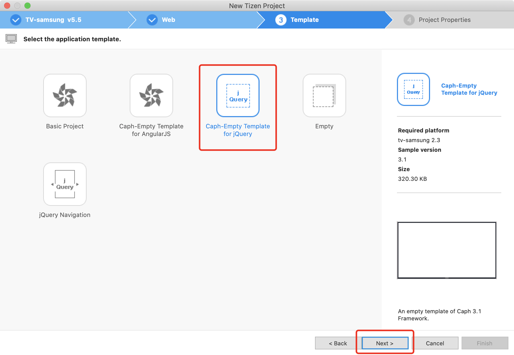
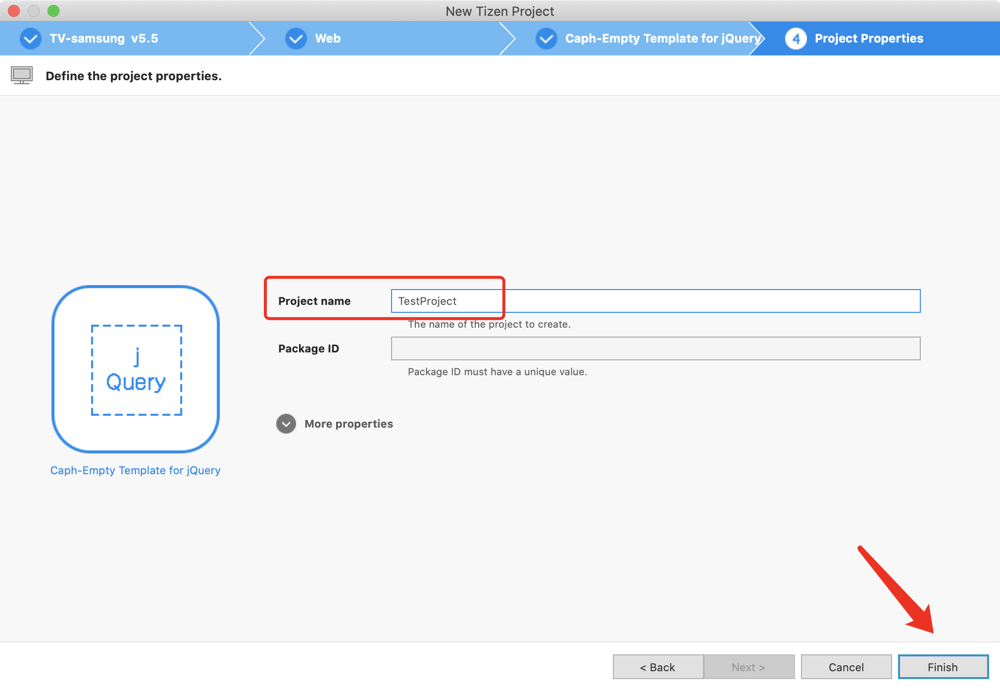

<!-- 项目大标题 -->
<h1 align="center">本地项目创建以及配置说明</h1>
<!-- 文档说明 -->
本地通过开发器创建创建项目、配置项目以及引入Tizen.sdk的简单说明<br/>

## Tizen项目创建以及配置
#### 项目创建
第一步：选择Template选项进行创建  

第二步：选择Tv选项进行创建  

第三步：按照图中选择Web Application  

第四步：其实选择哪一个都行，为了代码最简化选择第3个或者第4个

第五步：最后一步创建项目名称，就创建好项目了

第六步：将以前的xml文件替换当前的xml文件，
- id="T8fwiq5qPd.reactCli" package="T8fwiq5qPd"一定要将最新的复制过来，不要用以前老的id
```xml
<?xml version="1.0" encoding="UTF-8"?>
<widget xmlns:tizen="http://tizen.org/ns/widgets" xmlns="http://www.w3.org/ns/widgets" id="https://developer.tizen.org/" version="1.0.1" height="1080" width="1920" viewmodes="fullscreen">
    <access origin="*" subdomains="true"></access>
    <tizen:application id="T8fwiq5qPd.reactCli" package="T8fwiq5qPd" required_version="2.3"/>
    <content src="index.html"/>
    <feature name="http://tizen.org/feature/screen.size.normal.1080.1920"/>
    <icon src="icon.png"/>
    <tizen:metadata key="http://samsung.com/tv/metadata/use.network" value="true"/>
    <tizen:metadata key="http://samsung.com/tv/metadata/multiscreen.support" value="true"/>
    <tizen:metadata key="http://samsung.com/tv/metadata/multitasking.support" value="true"/>
    <name>项目脚手架</name>
    <tizen:privilege name="http://developer.samsung.com/privilege/network.public"/>
    <tizen:privilege name="http://developer.samsung.com/privilege/network"/>
    <tizen:privilege name="http://tizen.org/privilege/network.connection"/>
    <tizen:privilege name="http://developer.samsung.com/privilege/network.partner"/>
    <tizen:privilege name="http://tizen.org/privilege/tv.inputdevice"/>
    <tizen:privilege name="http://developer.samsung.com/privilege/productinfo"/>
    <tizen:profile name="tv"/>
    <tizen:setting screen-orientation="landscape" context-menu="enable" background-support="disable" encryption="disable" install-location="auto" hwkey-event="enable"/>
</widget>
```
#### react中配置Tizen项目的结构说明
1. 用Tizen开发器新建一个空项目，将项目生成的配置文件copy到此脚手架的public文件夹下，以便编译的时候，自动将文件打包到build中
2. 在Tizen中导入项目，要将编译好的build文件夹导入
3. 项目的ID问题：每次要创建一个最新的空项目，将其中的id复制到当前项目中，不然三星平台会检测出软件重复


## Tizen浏览器版本兼容问题
#### 三星官方API
* API文档地址：[tizen-web-device-api](https://developer.samsung.com/smarttv/develop/api-references/tizen-web-device-api-references.html)
#### API引入方式：
- 在项目的index.html中 引入 `<script type="text/javascript" src="$WEBAPIS/webapis/webapis.js"></script>`
- 在项目的config.xml中 引入 `<tizen:privilege name="http://developer.samsung.com/privilege/productinfo"/>`
- 使用方式：	`var duid = webapis.productinfo.getDuid();`（模拟器拿不到值，需要值可以在真机获取后使用）
